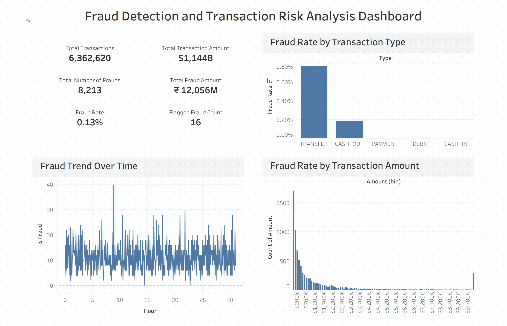

# Fraud Detection Analytics Pipeline using Databricks & Tableau
## Project Overview
Built an end-to-end fraud detection analytics pipeline on a large-scale financial transactions dataset containing 6.3M+ records.  
The project focused on identifying fraudulent transaction patterns, analyzing behavioral anomalies, and creating an interactive dashboard for fraud monitoring and risk analysis.

The solution was developed using Databricks, PySpark, SQL, and Tableau following a scalable data pipeline approach.

## Business Problem
Financial institutions process millions of transactions daily, making it difficult to manually identify fraudulent activity.

This project aims to:
- Detect suspicious transaction behavior
- Identify high-risk transaction patterns
- Analyze weaknesses in rule-based fraud flagging systems
- Enable faster fraud monitoring through dashboard-driven insights

## Dataset Information
The dataset contains simulated money transactions over a 30-day period with 6.3 million+ rows.
Following are the information reagrding it's columns:

`step`: Maps a unit of time in the real world. In this case 1 step is 1 hour of time. Total steps 744 (30 days simulation).

`type`:
- **CASH-IN**: is the process of increasing the balance of account by paying in cash to a merchant.
- **CASH-OUT**: is the opposite process of
- **CASH-IN**: it means to withdraw cash from a merchant which decreases the balance of the account.
- **DEBIT**: is similar process than
- **CASH-OUT**: and involves sending the money from the mobile money service to a bank account.
- **PAYMENT**: is the process of paying for goods or services to merchants which decreases the balance of the account and increases the balance of the receiver.
- **TRANSFER**: is the process of sending money to another user of the service through the mobile money platform

`amount`: Amount of the transaction in local currency. 

`nameOrig`: Customer who started the transaction. 

`oldbalanceOrg`: Initial balance before the transaction. 

`newbalanceOrig`: new balance after the transaction.

`nameDest`: Customer who is the recipient of the transaction.

`oldbalanceDest`: Initial balance recipient before the transaction. Note that there is not information for customers that start with M (Merchants).

`newbalanceDest`: New balance recipient after the transaction. Note that there is not information for customers that start with M (Merchants).

`isFraud`: This is the transactions made by the fraudulent agents inside the simulation. In this specific dataset the fraudulent behavior of the agents aims to profit by taking control or customers accounts and try to empty the funds by transferring to another account and then cashing out of the system.

`isFlaggedFraud`: The business model aims to control massive transfers from one account to another and flags illegal attempts. An illegal attempt in this dataset is an attempt to transfer more than 200.000 in a single transaction.

## Project Worlflow
### Data Ingestion (Bronze Layer)
- Loaded raw CSV transaction data into Databricks
- Stored raw data in Delta format
- Preserved original schema for scalable processing

**Tasks Performed:**
- Schema inference
- Initial validation
- Delta table creation

### Data Cleaning & Transformation (Silver Layer)
Performed data preprocessing and feature engineering using PySpark.

**Key Transformations:**
- Removed duplicate transactions
- Handled missing and inconsistent values
- Created fraud behavior indicators
- Extracted time-based transaction patterns

**Engineered Features:**
- High-value transaction flags
- Account-drained indicators
- Transaction velocity metrics
- Balance inconsistency checks
- Hourly transaction behavior

### Fraud Analytics & SQL Analysis (Gold Layer)
Conducted fraud-focused SQL analysis to identify behavioral patterns and business insights.

**Key Analysis Questions:**
- Which transaction types are most vulnerable to fraud?
- Do high-value transactions show higher fraud rates?
- Are fraudsters draining accounts completely?
- How effective is the existing fraud flagging system?
- What transaction patterns are most suspicious?

## Dashboard & Visualization
Built an interactive fraud monitoring dashboard in Tableau.

**Dashboard Highlights**

**KPI Metrics:**
- Total Transactions
- Total Transaction Amount
- Total Fraud Count
- Total Fraud Amount
- Fraud Rate

**Visual Analysis:**
- Fraud Rate by Transaction Type
- Fraud Transactions Over Time
- Fraud Distribution by Amount Range
- High-Risk Transaction Patterns

## Key Insights

**Fraud Concentration**  
Fraud activity was primarily concentrated in:  
- TRANSFER
- CASH_OUT

**High-Value Risk**  
Large-value transactions showed significantly higher fraud occurrence.

**Account Draining Behavior**  
Fraudulent transactions frequently resulted in accounts being fully drained.

**Rule-Based Detection Limitations**  
Many fraudulent transactions were not captured by the existing flagged fraud system, highlighting weaknesses in static threshold-based monitoring.

## Business Impact

This project demonstrates how scalable analytics pipelines can help financial institutions:

- Improve fraud detection efficiency
- Reduce financial losses
- Identify suspicious transaction behavior faster
- Support fraud investigation teams with real-time insights

## Skills Demonstrated

- Large-scale data processing with PySpark
- SQL-based fraud analytics
- Feature engineering for fraud detection
- Databricks workflow development
- Dashboard design & KPI reporting
- Financial transaction analysis

## Future Improvements

- Real-time fraud streaming pipeline
- Machine learning fraud prediction model
- Automated fraud alert system
- Integration with Power BI/Tableau
